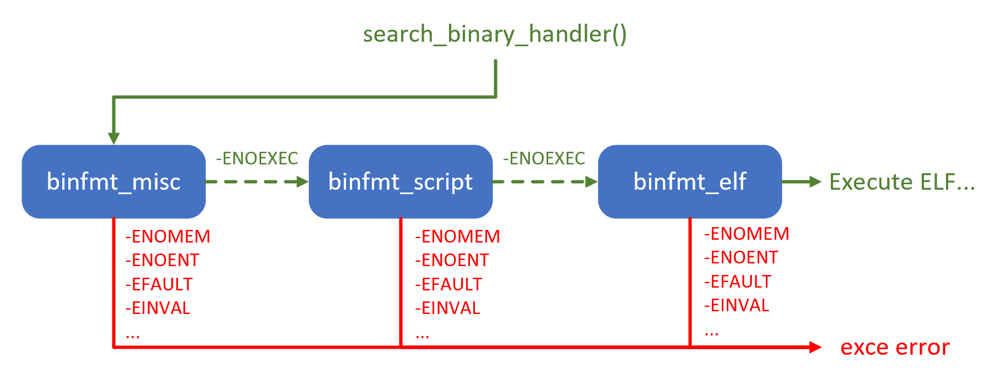

# Chapter 1 - 二进制文件执行过程

## 1.1 内核如何执行一个二进制文件

当我们在 shell 中输入命令，试图执行一个二进制文件时，shell 会调用 Linux 内核的 `execve` 系统调用。该系统调用会将二进制文件载入内存，判断其格式是否合法、是否具有执行权限。如果一切正常，则将当前进程的代码段、数据段替换为新程序的段，并设置好命令行参数、环境变量、新的程序入口，完成新程序开始运行前的一切准备工作。

如果 `execve` 的执行一切正常，那么该进程原有程序的运行环境都会被新进程完全替换。对于使用 shell 的用户来说，希望能够在运行完一条命令后再次回到 shell 中继续输入下一条命令。为了避免 shell 进程在调用 `execve` 之后被新程序覆盖，在 shell 的实现中，通常会通过 `fork` 系统调用，先复制出一个当前进程的副本，然后在副本进程中调用 `execve`。执行结束后，回到 shell 的原进程中，使得用户可以继续执行下一个程序。


## 1.2 内核如何识别不同格式的二进制文件

内核支持执行多种不同格式的二进制文件。比如一个 ELF 文件，或是一个 shell script，甚至还可以是一幅图片，或一个 PDF 文档。对于不同的二进制文件格式，内核需要为其准备不同的运行环境：

* 对于一个 ELF 文件，内核需要找到该文件的代码段和数据段，以及程序的首条指令地址，并将这些信息设置在进程控制块中
* 对于一个 shell script，内核需要寻找脚本指定的解释器，并将脚本文件名作为参数，启动脚本解释器解释执行脚本
* 对于一个 PDF 文档或图片，内核也需要寻找对应的解释器，并将文件名作为解释器参数，启动解释器

为了识别二进制文件的格式，内核会将二进制文件的前 128 个字节载入内存中如下的结构体中：


```c
#define CORENAME_MAX_SIZE 128

/*
 * This structure is used to hold the arguments that are used when loading binaries.
 */
struct linux_binprm {
    char buf[BINPRM_BUF_SIZE];
    /* ... */
} __randomize_layout;
```


内核根据 magic value \(每个格式特有的字节序列\) 等信息，识别出二进制文件的格式。比如：

* 根据文件开头是否是 `#!` 来判断是否是一个脚本文件
* 根据文件开头是否是 `0x7f` `0x45(E)` `0x4c(L)` `0x46(F)` 来判断是否是一个 ELF 文件
* ...

## 1.3 二进制文件格式处理程序 \(Binary Format Handler\)

在 Linux 4.15.0 中，内核能够执行哪些格式的二进制文件呢？

在该版本的内核源代码中，已经内置了部分二进制文件格式的处理程序 \(handler\)，位于内核代码的 `fs/` 目录下：

* `binfmt_aout` - a.out 格式
* `binfmt_elf` - ELF \(Execute and Link-able Format\) 格式
* `binfmt_elf_fdpic`
* `binfmt_em86`
* `binfmt_flat`
* `binfmt_misc` - 可在内核运行期间自行注册解释程序的二进制文件格式
* `binfmt_script` - 脚本文件格式，用于执行 shell、Perl 等格式的脚本


编译内核前，根据目标硬件平台进行编译配置后，有些二进制文件格式的处理模块将不会被编译进内核主映像；有些二进制文件格式的处理模块将会被编译为内核模块。


其中，每一种格式对应的处理程序，在编码上都以模块的形式实现 \(虽然编译后并不一定是模块\)，并且都用类似面向对象中多态的形式实现了一个统一的接口：


```c
/*
 * This structure defines the functions that are used to load the binary formats that
 * linux accepts.
 */
struct linux_binfmt {
    struct list_head lh;
    struct module *module;
    int (*load_binary)(struct linux_binprm *);
    int (*load_shlib)(struct file *);
    int (*core_dump)(struct coredump_params *cprm);
    unsigned long min_coredump;    /* minimal dump size */
} __randomize_layout;
```


其中，关注这三个函数指针：

* `*load_binary` 指向装入该格式二进制文件的函数
* `*load_shlib` 指向装入该格式共享库的函数
* `*core_dump` 指向装入该格式核心转储文件的函数

在操作系统初始化阶段，这些二进制格式的处理函数被依次添加到了一个链表上。当执行一个二进制文件时，内核实现将其头 128 字节以及相关信息读入 `struct linux_binprm` 结构体，然后依次遍历链表上的每一个 `struct linux_binfmt` 结构体，以 `struct linux_binprm` 作为参数，依次调用每种二进制格式对应的 `*load_binary` 函数。这一过程在 `fs/exec.c` 的如下函数中实现：


```c
int search_binary_handler(struct linux_binprm *bprm)
{
    /* 遍历二进制文件处理链表 */
    list_for_each_entry(fmt, &formats, lh) {
        /* 调用每个二进制格式的 load_binary() 函数 */
        retval = fmt->load_binary(bprm);
        /* 如果返回 -ENOEXEC，那么继续遍历链表 */
        /* 如果返回其它错误，则退出 */
        if (retval != -ENOEXEC || !bprm->file) {
            read_unlock(&binfmt_lock);
            return retval;
        }
    }
    /* ... */
    return retval;
}
```


在这个函数中，可能会有以下三种情况出现：

1. 当前处理函数不能识别这个二进制文件的格式，则返回 `-ENOEXEC` 的错误码，继续尝试用下一个二进制格式处理函数识别该文件的格式
2. 当前处理函数成功识别了这个二进制文件的格式，并顺利完成了执行这个二进制文件的准备工作，`execve` 系统调用正确返回
3. 当前处理函数成功识别了这个二进制文件的格式，但在执行该文件准备工作的过程中发生了错误 \(比如动态分配内存失败，或该文件的内容损坏/不一致\)，则将相应错误码返回 `execve` 系统调用并停止遍历链表。最终 `execve` 系统调用将错误码返回 bash，向用户提示运行失败的原因

以内核执行 ELF 文件为例，内核搜索 ELF 处理函数的过程如下图所示：



## 1.4 内核识别二进制文件格式的次序

上面的链表体现了典型的 Intel 架构 64-bit 机器中，内核默认编译配置下，识别一个二进制文件格式的次序。哪些因素决定了内核以不同的优先级依次识别各个二进制文件格式呢？

内核是在 **初始化阶段** 逐步构造二进制格式处理函数链表的。每个格式的处理函数被挂上链表的时机和方式由如下因素决定：

1. 二进制格式处理模块在内核中的初始化等级
2. 二进制格式处理模块被编译的顺序
3. 二进制格式处理模块被挂上链表的方式 \(在链表头部插入 / 在链表尾部插入\)

#### 内核初始化等级

在内核初始化阶段，内核为其各个模块的初始化划分了优先级：


```c
/*
 * A "pure" initcall has no dependencies on anything else, and purely
 * initializes variables that couldn't be statically initialized.
 *
 * This only exists for built-in code, not for modules.
 * Keep main.c:initcall_level_names[] in sync.
 */
#define pure_initcall(fn)           __define_initcall(fn, 0)

#define core_initcall(fn)           __define_initcall(fn, 1)
#define core_initcall_sync(fn)      __define_initcall(fn, 1s)
#define postcore_initcall(fn)       __define_initcall(fn, 2)
#define postcore_initcall_sync(fn)	__define_initcall(fn, 2s)
#define arch_initcall(fn)           __define_initcall(fn, 3)
#define arch_initcall_sync(fn)      __define_initcall(fn, 3s)
#define subsys_initcall(fn)         __define_initcall(fn, 4)
#define subsys_initcall_sync(fn)    __define_initcall(fn, 4s)
#define fs_initcall(fn)             __define_initcall(fn, 5)
#define fs_initcall_sync(fn)        __define_initcall(fn, 5s)
#define rootfs_initcall(fn)         __define_initcall(fn, rootfs)
#define device_initcall(fn)         __define_initcall(fn, 6)
#define device_initcall_sync(fn)    __define_initcall(fn, 6s)
#define late_initcall(fn)           __define_initcall(fn, 7)
#define late_initcall_sync(fn)      __define_initcall(fn, 7s)
```


其中，等级越高 \(优先级数值越小\) 的模块越先被初始化。在每个二进制格式处理函数中，都会声明当前模块在哪个等级上被初始化。以 ELF 格式处理模块 \(`binfmt_elf`\) 为例：


```c
core_initcall(init_elf_binfmt);
module_exit(exit_elf_binfmt);
MODULE_LICENSE("GPL");
```


以上代码表示内核会在 `core_initcall` \(1 号优先级\) 的等级上，通过调用 `init_elf_binfmt()` 函数，将 ELF 格式的处理模块插入到链表中。

#### 模块编译的相对顺序

模块编译的相对顺序体现在 Makefile 文件中，位于前面的模块先被编译。以 `fs/Makefile` 为例：


```text
obj-$(CONFIG_BINFMT_AOUT)	+= binfmt_aout.o
obj-$(CONFIG_BINFMT_EM86)	+= binfmt_em86.o
obj-$(CONFIG_BINFMT_MISC)	+= binfmt_misc.o
obj-$(CONFIG_BINFMT_SCRIPT)	+= binfmt_script.o
obj-$(CONFIG_BINFMT_ELF)	+= binfmt_elf.o
obj-$(CONFIG_COMPAT_BINFMT_ELF)	+= compat_binfmt_elf.o
obj-$(CONFIG_BINFMT_ELF_FDPIC)	+= binfmt_elf_fdpic.o
obj-$(CONFIG_BINFMT_FLAT)	+= binfmt_flat.o
```


在同一个初始化等级上，先被编译的模块会先被初始化。比如，假设上述所有模块都是由 `core_initcall()` 等级进行初始化，那么模块就按从上到下的顺序依次初始化。

#### 处理模块在链表上注册的方式

每个二进制格式处理模块中都定义了初始化函数。在该函数中，该模块将其自身注册到内核的二进制文件处理函数链表上。内核提供两种注册二进制文件处理模块的方式：

* `register_binfmt(&xxx_format)`
* `insert_binfmt(&xxx_format)`

两种注册方式的差别是，`register_binfmt` 将处理模块注册在 **链表尾部**，而 `insert_binfmt` 将处理模块注册在 **链表头部**。

## 1.5 对 ELF 文件进行签名验证的思路

本解决方案的目标是，在内核为执行一个 ELF 文件进行原有的准备工作之前，先对 ELF 中的签名进行验证。如果验证通过，则继续进行准备工作；如果验证失败，则内核拒绝执行这个 ELF 文件。

解决方案的核心思想是，以 [二进制格式处理程序](chapter-1-binary-execution-procedure.md#13-er-jin-zhi-wen-jian-ge-shi-chu-li-cheng-xu-binary-format-handler) 的形式，实现一个 ELF 签名验证模块 \(`binfmt_elf_signature_verification`\)，并将该模块注册在链表中 ELF 处理模块 \(`binfmt_elf`\) 之前。在该模块中，实现签名验证的逻辑。如果签名验证通过，则返回 `-ENOEXEC` 错误码，使得内核继续遍历链表，最终能够调用真正的 ELF 处理模块；如果签名验证不通过，则直接返回其它错误码，使得内核不再继续调用真正的 ELF 处理模块。

在这个 ELF 签名验证模块中，需要进行的工作主要有两点：

1. 格式检查 - 判断该二进制文件是否符合 ELF 格式，跳过所有非 ELF 格式的文件
2. 签名验证 - 如果文件符合 ELF 格式，则取出其中附带的数字签名，并进行签名验证

用户可以在内核启动后，通过 `insmod` 命令动态加载这个模块，通过 `rmmod` 命令动态卸载这个模块。当用户准备挂载该模块时，内核中的二进制处理模块链表已经初始化完成了。由于模块被插入链表的方式只有从链表头插入和从链表尾插入，而插入到链表尾部使得模块无法在系统内置的 `binfmt_elf` 模块之前被执行，因此只能在链表的头部插入这个处理模块：


ELF 签名验证模块可能返回的错误原因：

* 内核中缺少用于签名验证的密钥
* ELF 文件中没有附带数字签名
* ELF 文件中附带了数字签名，但其中的内容无法通过签名验证
* ELF 格式正确但内容损坏
* 内核运行时的一些突发错误 \(如动态分配内存失败\)
* ...

非 ELF 格式的二进制文件 \(如 shell 脚本\) 将无法通过 `binfmt_elf_signature_verification` 模块的 ELF 格式检查，从而返回 `-ENOEXEC`，由之后其它的二进制文件处理模块进行处理。

## 1.6 参考资料

[LWN.net - How programs get run](https://lwn.net/Articles/630727/)

[Stackoverflow - How does kernel get an executable binary file running under linux?](https://stackoverflow.com/questions/8352535/how-does-kernel-get-an-executable-binary-file-running-under-linux)

[Linux Journal - Playing with Binary Formats](https://www.linuxjournal.com/article/2568)

[The Linux Kernel - Kernel Support for miscellaneous Binary Formats \(binfmt\_misc\)](https://www.kernel.org/doc/html/latest/admin-guide/binfmt-misc.html)

