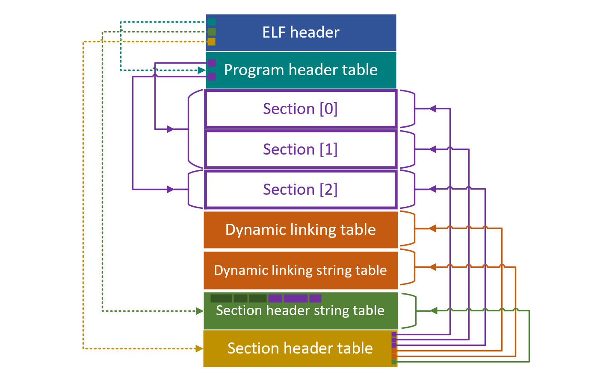

# Chapter 2 - ELF 文件格式分析

## 2.1 关于 ELF

**可执行与可链接格式** \(Executable and Linkable Format, ELF\) 是一种可执行文件、目标代码、共享库、核心转储文件的通用标准文件格式。ELF 标准最早发布于一个名为 System V Release 4 \(SVR4\) 的 Unix 操作系统版本的应用二进制接口 \(Application Binary Interface, ABI\) 标准规范中，并迅速被各大 Unix 版本所接受。1999 年，ELF 格式被选为 Unix 或类 Unix 系统在 x86 处理器平台上的标准二进制文件格式。

在设计上，ELF 格式具有 **灵活、可扩展、跨平台** 的特点。比如，其支持不同的字节顺序 \(大小端\)、不同的地址空间 \(32/64\)、不排斥任何特定的 CPU 或指令集体系结构 \(Instruction Set Architecture, ISA\)。因此，ELF 格式能够在很多不同硬件平台的不同操作系统上运行。

## 2.2 ELF 文件的视角与格式

ELF 文件具有三种主要的目标类型：

* 可重定位文件 - 包含可与其它目标文件链接在一起的代码和数据
* 可执行文件 - 为 `exec` 指明如何创建程序的进程映像
* 共享库文件 - 与其它可重定位文件或共享库文件链接为另一个目标；或与可执行文件和其它共享库文件一起形成进程映像

根据 ELF 文件被使用的方式，文件内容可以有两种视角：

* 链接视角 \(用于构造一个程序\)
* 执行视角 \(用于运行一个程序\)

两种视角如下图所示：

Section 主要用于链接器对代码的重定位，如汇编程序中的 `.text` `.data`。而当文件载入内存执行时，目标代码中的 section 会被链接器组织到可执行文件的各个 segment 中。

如上图所示，ELF 文件除去各 section/segment 以外，主要包含三个重要部分：

1. ELF header
2. Program header table
3. Section header table

ELF header 指明了 ELF 文件的整体信息，如 ELF 文件的 magic value、类型、版本、目标机器等。另外，ELF 还指明了 program header table 与 section header table 两个表在文件中的偏移位置、条目个数、条目大小。这两个表的位置和长度随着 section/segment 的个数而变化，而 ELF header 总是位于文件最开头，且长度固定。显然，如果想要访问 program header table 和 section header table 中的信息，必须通过 ELF header。

Program header table 主要描述了将哪一个或哪几个 section 组织为一个 segment，以及各个 segment 的描述信息。Section header table 描述了 ELF 文件中所有的 section，以及每个 section 的类型、长度等描述信息。


Section header table 中并不存储每个 section 的名称。所有 section 的名称全部存储在一个名为 section header string table 的 section 中，名称之间用 `\0` 分隔。在 ELF header 中，记录了该 section 在 section header table 中的索引。


## 2.3 内核从 ELF 中取得数字签名的步骤

内核在对 [二进制文件处理函数链表](chapter-1-binary-execution-procedure.md#15-dui-elf-wen-jian-jin-hang-qian-ming-yan-zheng-de-si-lu) 进行遍历时，已经读取了该文件的头 128 字节。如果该二进制文件是一个 ELF 文件，那么已读取的内容中已经包含了 ELF 文件的 ELF header。首先，通过 magic value 检验二进制文件是否是一个 ELF 文件；判断 ELF 文件类型是否为 `ET_EXEC` \(可执行文件\) 或 `ET_DYN` \(动态链接文件\)。

其次，根据 ELF header 中指示的 section header table 的位置、条目个数、每个条目的大小，可以将 section header table 读入内存；根据 ELF header 中指示的 section header string table 的索引，以及已经读入内存的 section header table，可以将 section header string table 读入内存。

同时遍历 section header table \(每个 section 的描述信息\) 和 section header string table \(每个 section 的名称\)，可以定位到与签名程序约定好的签名信息 section 与被签名 section，如：

* 被签名 section `.text` 与签名信息 section `.text_sig`
* ...

在找到这两个相互对应的 section 之后，再根据 section header table 中指示的这两个 section 在文件中的位置与长度，将这两个 section 的具体数据载入内存。

最终，对这一对 section 数据进行签名验证。如果所有的签名验证都正确，那么 [binfmt\_elf\_signature\_verification](chapter-1-binary-execution-procedure.md#15-dui-elf-wen-jian-jin-hang-qian-ming-yan-zheng-de-si-lu) 模块会返回 `-ENOEXEC` 错误码，使内核随后调用真正的 ELF 处理模块完成相应的工作；如果签名验证错误，那么模块返回其它错误码，内核将无法继续执行这个 ELF 文件。

## 2.4 参考资料

[Executable and Linking Format \(ELF\) Specification](http://www.skyfree.org/linux/references/ELF_Format.pdf)

