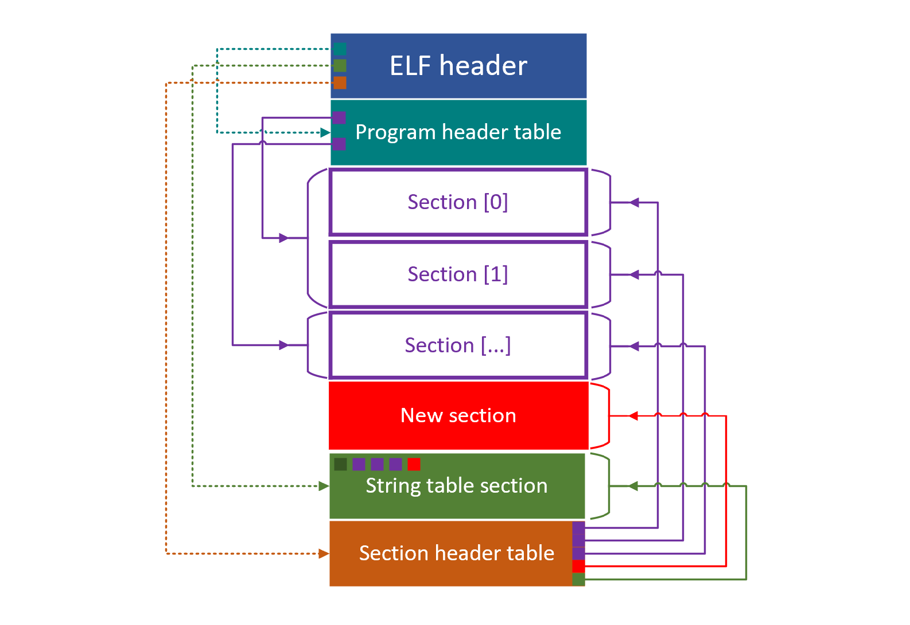
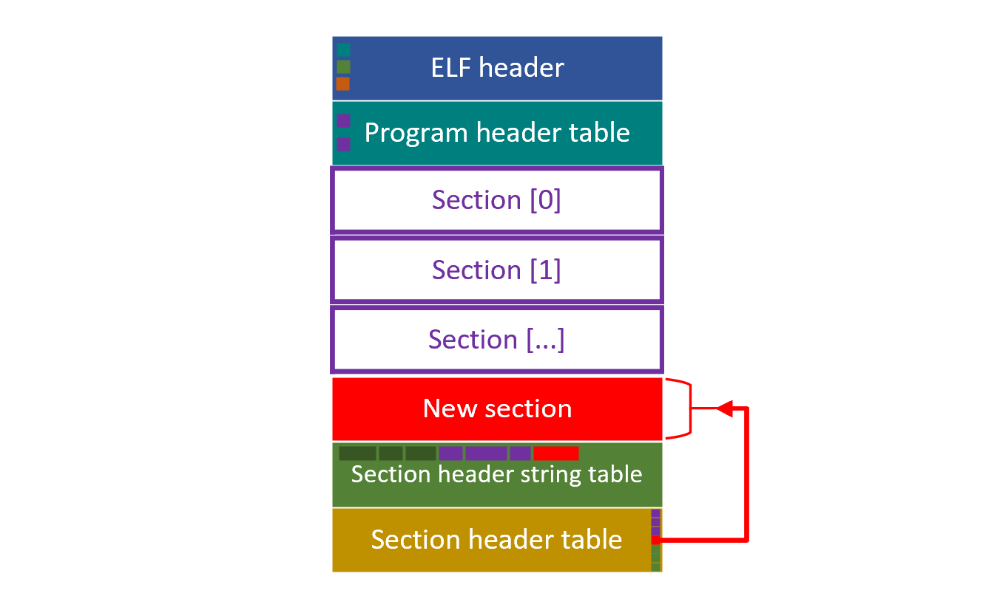

# Chapter 5 - ELF 签名注入

## 5.1 签名数据存放位置

要将签名数据附在原有的 ELF 文件中，且不破坏 [ELF 的结构](../group-1-kernel-signature-verification/chapter-2-elf-format-analysis.md)，使其能够在没有签名验证机制的 OS 上也能运行，有两种可能的方式：

* 在 ELF 文件的尾部追加签名
* 在 ELF 文件的中间以符合 ELF 规范的方式添加若干个包含签名数据的 section

在尾部追加签名的方式比较简单，但从文件整体视角来看，该文件已经不是一个符合 ELF 格式的文件了。如果我们需要对 ELF 文件的多个 section 进行签名，在文件末尾追加的方法将具有较差的可扩展性和灵活性。此外，将无法通过 `readelf` 或 `objdump` 等工具读取签名数据。

在 ELF 文件中间添加数据的方法稍微复杂一些，因为其中涉及到对 ELF 的文件格式进行解析。另外，在 ELF 文件中添加若干新的 section，可能会涉及到对 ELF 文件中其它数据的修改。但是，通过这种方法，我们可以在 ELF 文件中添加任意多个 section，并可以在 ELF 的 section header table 结构中记录这些 section 的元信息。这样方便内核从签名后的 ELF 文件中快速获取有效的签名数据。

## 5.2 将签名数据 section 注入 ELF 文件

在 ELF 文件中，`.symtab` `.strtab` `.shstrtab` 三个 section 较为特殊。根据惯例，通常将这三个 section 布局为 ELF 文件的最后三个 section。如果我们想要在 ELF 文件中插入一个新的 section 时，应当把新插入的 section 恰好放置在这三个特殊 section 之前，如下图红色部分所示。这样做有两点好处：

* 保持了 ELF 文件布局的惯例
* 避免破坏 program header table 与其它 section 之间的引用关系

基于这种方案，注入一个新的 section 涉及到对 ELF 文件多个部分的修改：

* ELF header
  * Section header table 在文件中的偏移会被插入的内容向后挤
  * Section header table 中的 entry 数量将会增加
  * 新的 section 被插入在三个特殊 section 的前面，导致 ELF header 中指向 section header string table section 的索引增加
* Section header table
  * 新增一个 entry 指明新 section 在文件中的位置、长度、类型等信息
  * 三个特殊 section 由于后移，entry 中的位置信息、链接信息、长度信息等发生更新
* Section header string table section
  * 新 section 的名称字符串插入到这个 section 中，引发该 section 的长度发生变化
* Section 数据区域
  * 签名数据作为新的 section 被添加


一个 ELF 标准中没有规定但是业界实现中普遍存在的细节：section header table 以及 `.symtab` `.strtab` `.shstrtab` 这三个特殊 section 在文件中的偏移总是对齐 8 字节地址，以充分利用总线宽度提升性能。在签名程序的实现中，我们也考虑到了这一点。


在签名程序的具体实现中，我们将 ELF 文件中的下列部分载入内存：

* ELF header
* Section header table
* Section header string table

我们为 section header table 多分配了一块内存，并将三个特殊 section 在表中的 entry 向后移动，同时更新这三个 entry 中需要被修改的信息。然后我们在空出的 entry 中为新增的 section 设置信息。

在这一过程进行的同时，顺带计算在文件中需要注入字节的偏移位置与字节数。


这里阐明文章中 **注入** 的概念。对于普通的文件写入，可被理解为从文件中的某个偏移位置开始 **覆盖** 文件中的原有内容，\(如果覆盖内容没有超出文件原有长度\) 将不会改变文件的长度。而注入特指在文件中插入内容，**将文件中插入位置之后的原有内容向后挤**，从而一定会引发文件长度的变化。

对于文件中位置、长度固定，而内容需要被修改的部分，使用文件写入 \(比如 ELF header\)；对于文件中必须新增的数据，使用数据注入 \(比如签名数据\)。


将被注入文件的字节由三部分组成：

* 签名数据
* 签名 section 的名称字符串
* 补齐 8 字节地址的无用字符

基于上述工作，签名程序能够确定 ELF header 中记录的 section header table 偏移量的最终值。最终，将内存中修改后的 ELF header 与 section header table 覆盖原文件中的相同部分；然后，在计算好的文件偏移处注入准备好的数据。


在注入数据时，应当先处理在文件中注入位置靠后的数据。如果首先处理在文件中注入位置靠前的数据，将会影响到之后注入的数据在文件中的注入位置。


签名程序会在被签名 section 名称的基础上加上 `_sig` 后缀，成为对应的签名数据 section。如，对于保存 ELF 程序指令的 `.text` section，签名程序会将签名数据作为一个名为 `.text_sig` 的 section 附加到 ELF 文件中。如果在解析 ELF section 的过程中发现已经存在名称以 `_sig` 为后缀的 section，则签名程序会中止退出，以防止重复签名。

在签名期间，签名程序会产生一些临时文件，用于保存被签名的若干个 section 对应的签名数据；在签名完成之后，这些临时文件将会被清除。

签名程序可以指定一个被签名文件名，以及一个可选的输出文件名。如果不指定输出文件名，对于一个名为 `elf`的 ELF 文件，在签名成功后，签名程序会保留未被签名的旧版本 ELF 文件 `elf.old` 作为备份，而注入签名后的新 ELF 文件将会被命名为原先的 `elf`。具体的使用方法参见 [后续](../group-3-usage/chapter-9-elf-sign.md#82-qian-ming-cheng-xu-de-shi-yong-fang-shi)。

## 5.3 兼容模式

对于一些 ELF 文件，比如 [GNU Core-utils](https://www.gnu.org/software/coreutils/)，其布局与较新 GCC 编译器编译出的 ELF 文件存在布局上的差异：

* 不包含 `symbol table` 和 `string table` 两个 section
* 只包含 `section header string table`。

在签名程序中，我们提供了一个 `-c` 的选项，可以以 **兼容模式** 对 ELF 文件进行签名。在兼容模式下，签名数据 section 将会被加入到 `section header string table` 的前一个 section 位置：

## 5.4 参考资料

[A tutorial introduction to _libelf_](https://sourceforge.net/projects/elftoolchain/files/Documentation/libelf-by-example/20120308/libelf-by-example.pdf/download)\_\_

[Adding section to ELF file](https://stackoverflow.com/questions/1088128/adding-section-to-elf-file)

[ELF format manipulation](https://stackoverflow.com/questions/7601344/elf-format-manipulation)

[How to remove a specific ELF section, without stripping other symbols?](https://stackoverflow.com/questions/31453859/how-to-remove-a-specific-elf-section-without-stripping-other-symbols)

