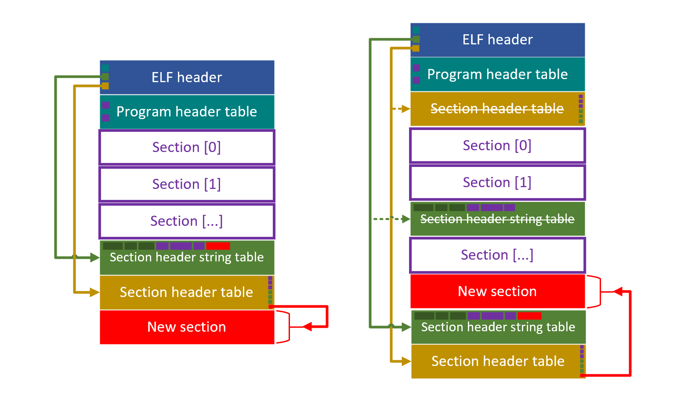

# Chapter 5 - ELF 签名注入

## 5.1 签名数据存放位置

想要将签名数据附在原有的 ELF 文件中，且不破坏 ELF 的结构使其能够在没有签名验证机制的 OS 上也能运行，要么在 ELF 文件的尾部追加签名，要么在 ELF 文件的中间以符合 ELF 规范的方式添加若干段签名数据。

在尾部追加签名的方式比较简单，但从文件整体来看，该文件已经不是一个符合 ELF 格式的文件了。此外，如果我们需要对 ELF 文件的多个 section 进行签名，在文件末尾追加的方法将具有较差的可扩展性和灵活性。

在 ELF 文件中间添加数据的方法稍微复杂一些，因为其中涉及到对 ELF 的文件格式进行解析。另外，在 ELF 文件中添加若干新的 section，可能会涉及到对 ELF 文件中其它数据的修改。但是，通过这种方法，我们可以在 ELF 文件中随意添加 section，并可以在 ELF 结构中记录这些 section 的一些元信息。这样有便于内核从签名后的 ELF 文件中快速获取有效的签名数据。我们使用了 [libelf-dev](https://sourceforge.net/p/elftoolchain/wiki/Home/) 库的 API 完成解析、修改 ELF 文件的工作。

## 5.2 将签名数据 section 注入 ELF 文件

根据 ELF 文件的格式，如下图所示：

加入一个新的 section 可能涉及到对 ELF 多个部分的修改：

* ELF header 中的变动
  * Section header table 在文件中的偏移发生改变
  * Section header 的数量将会增加
  * 如果新的 section 被安排在 string table section 的前面，那么 string table section 的索引将会增加
* Section header table 中的变动
  * Section header table 中将会多一个元素，该元素指明新 section 在文件中的位置及其大小
* String table section 中的变动
  * String table section 中将会加入新 section 的名称
* Section 数据区域的变动
  * 一个新的带有签名数据的 section 将会被添加在 section 数据区域中

签名程序会在被签名 section 名称的基础上加上 `_sig` 后缀，成为被签名 section 对应的签名数据 section。如，对于保存 ELF 程序指令的 `.text` section，签名程序会将签名数据作为一个名为 `.text_sig` 的 section 附加到 ELF 文件中。

在签名期间，签名程序会产生一些临时文件，用于保存被签名的若干个 section 对应的签名数据；在签名完成之后，这些临时文件将会被清除。

对于一个名为 `elf`的 ELF 文件，在签名成功后，签名程序会保留未被签名的旧版本 ELF 文件 `elf.old` 作为备份，而注入签名后的新 ELF 文件将会被命名为原先的 `elf`。

## 5.3 参考资料

[A tutorial introduction to _libelf_](https://sourceforge.net/projects/elftoolchain/files/Documentation/libelf-by-example/20120308/libelf-by-example.pdf/download)\_\_

[Adding section to ELF file](https://stackoverflow.com/questions/1088128/adding-section-to-elf-file)

[ELF format manipulation](https://stackoverflow.com/questions/7601344/elf-format-manipulation)

