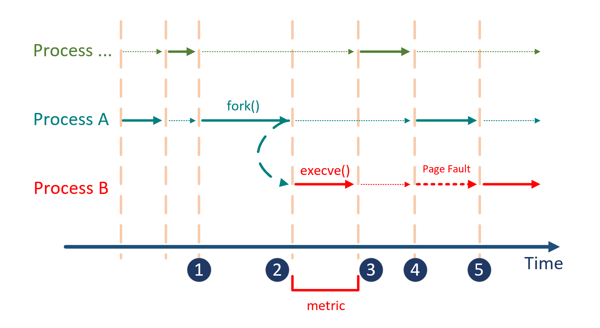

# Chapter 10 - 签名验证机制开销评估

## 9.1 开销分析

我们的解决方案在内核为执行 ELF 文件进行准备的过程中，额外引入了签名验证机制，从而引入了 CPU、内存、I/O 上的开销：

* CPU 的开销来源于摘要算法和 _RSA_ 算法解密所带来的计算开销
* 内存开销主要来源于将 ELF 中的被保护 section 和签名 section 分别保存在内存缓冲区中用于签名验证
* I/O 开销主要来源于将 ELF 文件的不同 section 载入内存的开销

这里的开销主要分为两个维度：**时间** 上的开销，以及 **空间** 上的开销。

## 9.2 时间开销

我们评估了签名验证机制所带来的时间开销。具体地，评估带有签名验证机制的内核，在执行一个 ELF 文件前的准备工作中，比不进行签名验证的内核慢多少。

我们选用的测试对象是 `/bin` 下的一些系统内置命令，它们实际上都是 ELF 文件，如 `ls` `mv` 等。我们对它们进行签名后，分别在签名验证模块已装载和未装载的条件下，以空参数执行这些 ELF 程序足够多次。虽然以默认参数执行一些 ELF 文件会导致程序错误退出，但我们只关心 **内核为执行二进制文件而进行准备工作** 的时间，而并不关心二进制文件真正开始执行后的时间。

我们以 `fs/exec.c` 文件中实现 exec 系统调用逻辑的 `do_execveat_common()` 函数作为评估对象。该内核函数主要负责为可执行文件准备运行环境，包括在进程控制块中设置新进程的入口地址、内存等相关工作。最重要的是，该函数中包括了对 [二进制文件处理模块](../group-1-kernel-signature-verification/chapter-1-binary-execution-procedure.md#13-er-jin-zhi-wen-jian-ge-shi-chu-li-cheng-xu-binary-format-handler) 的遍历和使用。

如图所示，虚线指示的区间表示进程没有被 CPU 运行；实线指示的区间表示进程正在被 CPU 运行。Process A 代表启动执行 ELF 文件的进程 \(比如 `bash`\)。

* 在 1 号时刻，A 进程接收了执行一个 ELF 文件的命令，于是调用 `fork()`，开始从自身复制一个新的进程 B
* 在 2 号时刻，`fork()` 结束，新复制的进程 B 准备就绪。为了避免 [Copy-on-write](https://en.wikipedia.org/wiki/Copy_on_write) 优化机制带来额外的开销，内核通常会调度新的进程 B 首先执行。进程 B 开始执行 `execve()`，载入新的 ELF 文件
* 在 3 号时刻，`execve()` 结束。此时，进程 B 的下一条将被执行的指令被设置为 ELF 文件的入口指令。但由于 Load-on-demand 机制，第一条指令所在的内存页还没有被载入内存。此时，所有进程全部处于就绪状态，可以被调度器调度
* 在 4 号时刻，调度器选择执行 B 进程。在访问 ELF 文件的第一条指令时，发生 [**缺页异常**](https://en.wikipedia.org/wiki/Page_fault)，由异常处理程序从磁盘上将该指令所在的页装入内存；在此过程中，调度器可能会选择其它进程执行
* 在 5 号时刻，B 进程所要访问的第一条指令已经在内存中；当调度器调度到 B 进程时，B 进程真正开始运行

我们评估的是签名验证机制在 `execve()` 的执行过程中引入的开销，即图中 2 号时刻与 3 号时刻之间的时间。我们将每个待测试的 ELF 文件分别在签名验证模块装载和未装载的内核上运行足够多的次数，并统计前后 `execve()` 执行时间增加的百分比。机器环境与统计单位：

* Lenovo® R720, Intel® Core™ i7-7700HQ CPU @ 2.80GHz \* 8
* 15.5 GiB Memory
* 60GB SSD
* Deepin 15.11, x64
* 时间单位：微秒 \(μs\)

| ELF 文件名 | 没有签名验证的平均执行时间 | 签名验证后的平均执行时间 | 开销 |
| :--- | :--- | :--- | :--- |
| cp | 94.94 | 869.132 | 9.1545 |
| df | 97.087 | 712.007 | 7.3337 |
| echo | 94.597 | 511.307 | 5.4051 |
| false | 91.869 | 494.750 | 5.3854 |
| grep | 98.181 | 1275.288 | 12.9892 |
| kill | 96.786 | 466.024 | 4.8150 |
| less | 96.456 | 907.837 | 9.4119 |
| ls | 97.489 | 823.131 | 8.4433 |
| mkdir | 95.568 | 704.105 | 7.3676 |
| mount | 100.155 | 520.235 | 5.1943 |
| mv | 93.213 | 909.927 | 9.7618 |
| rm | 92.616 | 628.854 | 6.7899 |
| rmdir | 95.957 | 531.206 | 5.5359 |
| tar | 97.198 | 1838.067 | 18.9105 |
| touch | 94.066 | 698.057 | 7.4209 |
| true | 93.025 | 491.792 | 5.2867 |
| umount | 106.101 | 503.504 | 4.7455 |
| uname | 94.898 | 579.819 | 6.1099 |

测试脚本与结果位于：[https://github.com/mrdrivingduck/linux-elf-binary-signer/tree/master/test](https://github.com/mrdrivingduck/linux-elf-binary-signer/tree/master/test)。

我们对测试结果进行了分析解读：

1. 没有签名验证的执行时间基本稳定；而加入签名验证机制后，执行时间与代码段长度相关 - 比如 `tar` 程序的代码段特别长，因此需要更长的时间用于计算代码段的摘要
2. 加入签名验证机制后执行时间平均翻 5 - 7 倍，主要原因是读取 ELF 文件的 section header table、section header string table、签名 section 与被签名 section 而引入了额外的 I/O 开销。由于 `execve()` 原本就能够在 100μs 左右的时间内结束，是一个相对较快的过程；而额外的 I/O 操作起码会将 `execve()` 的执行时间提升半个数量级

## 9.3 空间开销

这里主要关注内核为被验证的 ELF section 所动态分配的内存空间。由于内存空间会在使用完毕后被回收，这里只关心动态分配内存空间的极限值。即，内核最大能够支持分配多大的内存将一个 section 装入内存进行验证。

## 9.4 参考资料

[Wikipedia - Copy-on-write](https://en.wikipedia.org/wiki/Copy-on-write)

[Mr Dk.'s blog - linux-kernel-comments-notes/Chapter 12 - 文件系统/Chapter 12.15 - exec.c 程序](https://github.com/mrdrivingduck/linux-kernel-comments-notes/blob/master/Chapter%2012%20-%20%E6%96%87%E4%BB%B6%E7%B3%BB%E7%BB%9F/Chapter%2012.15%20-%20exec.c%20%E7%A8%8B%E5%BA%8F.md)

[Stackoverflow - Does Linux load program-pages on demand?](https://stackoverflow.com/questions/19292744/does-linux-load-program-pages-on-demand)

